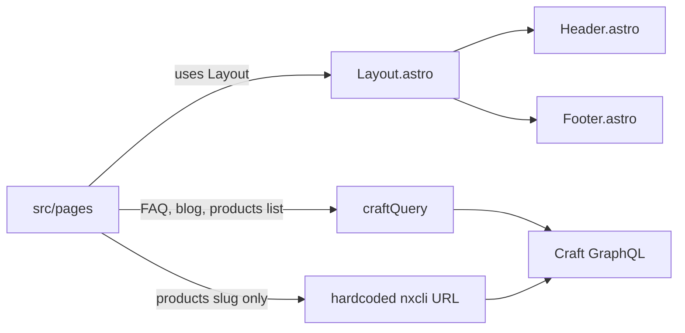

# Astro 7 + Craft CMS implementation plan

## Current architecture

Astro 7.1 (`astro: ^7.1.5`), default static output ([astro.config.mjs](astro.config.mjs) is empty). Pages live in [src/pages/](src/pages/); shared chrome in [src/components/](src/components/); Craft GraphQL client in [src/lib/craft.ts](src/lib/craft.ts).

**Pages using Layout** (Header + Footer via slot): [index.astro](src/pages/index.astro), [products.astro](src/pages/products.astro), [solutions.astro](src/pages/solutions.astro), [blog.astro](src/pages/blog.astro), [blog/[slug].astro](src/pages/blog/[slug].astro), [contact.astro](src/pages/contact.astro).

**Pages bypassing Layout** (raw `<html>`, Header only, **no Footer**): [faq/index.astro](src/pages/faq/index.astro), [faq/[category].astro](src/pages/faq/[category].astro), [products/[slug].astro](src/pages/products/[slug].astro).

**Craft access:** most pages call `craftQuery` with `import.meta.env.CRAFT_GRAPHQL_URL`. Product detail **does not** — unused `CRAFT_API` plus two `fetch` POSTs to `https://a744181dea.nxcli.io/api`. There is no `.env.example` and no `src/env.d.ts`. No Craft auth header (public GraphQL assumed).

**Home:** already merged. Commit `ce51a56` deleted `src/pages/home.astro` and replaced [index.astro](src/pages/index.astro) with that v2.1 homepage. [.gitignore](.gitignore) still lists `src/pages/home-v1-backup.astro` (not in the tree).

**Dead / duplicated UI:** [Nav.astro](src/components/Nav.astro) is unused. `productLines` is copied in Header, Footer, and index **and already drifted** (index has 6 items, no Duraframe; Header/Footer have 7 including Duraframe). FAQ `CATEGORIES` and `slugify` are copied across FAQ/product pages. Contact links (WhatsApp, X, email) are inlined in Header, Footer, FAQ, and product slug. [products.astro](src/pages/products.astro) does not link to `/products/[slug]` even though detail routes exist.

---

## Risk areas

- **Build-time Craft dependency:** static `getStaticPaths` and page queries fail if `CRAFT_GRAPHQL_URL` is missing or Craft is down. `craftQuery` does not check HTTP status or a missing URL.
- **SEO regression when wrapping FAQ/product slug in Layout:** those pages set `description`, canonical (`https://customcountermat.com/...`), and FAQPage JSON-LD. Current Layout only accepts `title`.
- **Visual mismatch:** Layout body uses `#0f172a` and global `section { padding: 100px 20px }`. FAQ/product slug use `#1e2937` and their own padding. Wrapping without Layout props/slots will change look and spacing.
- **Double Header:** FAQ/product slug import Header directly. Must **replace** that with Layout, not nest both.
- **GraphQL interpolation:** [blog/[slug].astro](src/pages/blog/[slug].astro) embeds `slug` in the query string. Product slug already uses variables — align blog to that.
- **Silent GraphQL failures:** product slug uses `response.json()` and never checks `errors` (unlike `craftQuery`).
- **Footer active state:** Footer `currentPage` omits `faq` / `blog`, so FAQ pages would get a Footer that never highlights FAQ.
- **Product query drift:** [products.astro](src/pages/products.astro) fetches a short field set; [products/[slug].astro](src/pages/products/[slug].astro) fetches a larger set (`downloadPdf`, `orderInformation`, `relatedFaqs`). Two shapes for the same section — keep both queries, but share fragments if extracting query modules.
- **Nav catalog drift:** unifying `product-lines.ts` must decide whether Duraframe belongs on the homepage grid or nav-only.

---

## Recommended refactoring order

Follow the stated priority. Do not move files (step 5) until Layout + Craft client + shared modules are in place, or imports will churn twice.

### Step 1 — Extend Layout, then wrap every page

1. Expand [src/components/Layout.astro](src/components/Layout.astro) props: `title`, `description?`, `canonical?`. Add a named slot for extra `<head>` content (JSON-LD). Keep Header + Footer + `<slot />`.
2. Make Layout styles safe for inner pages: avoid global `section { padding: 100px 20px }` applying to FAQ/product content, or scope those rules so existing Layout pages keep their look.
3. Migrate in this order (lowest visual risk first):
  - [products/[slug].astro](src/pages/products/[slug].astro) — drop raw html/head/Header; wrap in Layout; drop unused `currentPage` prop.
  - [faq/index.astro](src/pages/faq/index.astro) and [faq/[category].astro](src/pages/faq/[category].astro) — pass title/description/canonical; put JSON-LD in the head slot.
4. Confirm Header still derives `currentPage` from `Astro.url.pathname` (it already does; the prop on FAQ/product pages is unused).
5. Add `faq` (and `blog` if desired) to Footer’s `currentPage` map so the new Footer on FAQ is consistent.
6. Smoke-check each route: one Header, one Footer, no duplicate `<html>`, titles/canonical/JSON-LD intact.

### Step 2 — Remove hardcoded Craft CMS API URLs

1. Harden [src/lib/craft.ts](src/lib/craft.ts): require `CRAFT_GRAPHQL_URL`; throw a clear error if unset; check `response.ok` before parsing; keep existing `json.errors` handling; keep `variables` support.
2. Add `.env.example` with `CRAFT_GRAPHQL_URL=` (no real host). Add `src/env.d.ts` (`ImportMetaEnv.CRAFT_GRAPHQL_URL: string`).
3. Replace the three `fetch('https://a744181dea.nxcli.io/api', …)` calls and `CRAFT_API` in [products/[slug].astro](src/pages/products/[slug].astro) with `craftQuery(query, variables)`.
4. Change [blog/[slug].astro](src/pages/blog/[slug].astro) to `entry(section: "blog", slug: $slug)` with variables (same pattern as products).
5. Grep for `nxcli.io` / hardcoded `/api` and confirm zero remaining Craft endpoints.

### Step 3 — Replace duplicated configuration with reusable modules

Create small modules under `src/lib/` (or `src/data/`) and switch call sites:

| Module              | Source of duplication                         | Consumers                                                                                               |
| ------------------- | --------------------------------------------- | ------------------------------------------------------------------------------------------------------- |
| `site.ts`           | site origin, WhatsApp, X, email               | Layout canonical default, Header, Footer, FAQ CTAs, product slug CTAs                                   |
| `product-lines.ts`  | product name/slug lists (6 vs 7 items; Duraframe only in Header/Footer) | Header, Footer, index (index maps extra image/alt; nav can include nav-only items) |
| `faq-categories.ts` | `CATEGORIES` + slug list for `getStaticPaths` | both FAQ pages                                                                                          |
| `slugify.ts`        | identical `slugify` in 3 pages                | FAQ + product slug                                                                                      |

Optional in the same step: GraphQL query strings as exported constants next to `craftQuery` (`productsBySlug`, `allProductSlugs`, FAQ queries) so pages stay thin. Do not invent a CMS abstraction beyond this.

Leave [Nav.astro](src/components/Nav.astro) unused until step 5 (delete it then).

### Step 4 — Merge home into index (already done; cleanup only)

Git already did the content merge in `ce51a56`. This step is verification, not a second copy-paste.

1. Confirm there is no tracked `src/pages/home.astro` (current repo: none).
2. Keep [src/pages/index.astro](src/pages/index.astro) as the only `/` page. Do **not** restore `home-v1-backup.astro` or reintroduce `/home`.
3. If a local ignored backup exists, leave it ignored or delete it locally; do not copy v1 markup into index.
4. Grep for `/home` and `home.astro`; retarget any leftover links to `/`.
5. Drop the gitignore entry for `home-v1-backup.astro` if the backup is gone, so the old route cannot sneak back in unnoticed.

### Step 5 — Improve project structure

Do this last so paths change once:

1. Move Layout to Astro convention: `src/layouts/Layout.astro`; update all page imports.
2. Keep presentational pieces in `src/components/` (Header, Footer). Delete unused `Nav.astro` or fold its `navLinks` into Header if you want one nav source.
3. Group lib: `src/lib/craft.ts`, `src/lib/site.ts`, `src/lib/queries/*.ts`, `src/lib/slugify.ts`; data files in `src/data/` if you prefer data vs logic split.
4. Replace starter [README.md](README.md) with: env vars, `npm run dev/build`, Craft required at **build** time.
5. Optional follow-ups (out of the five priorities, do only if you want a tighter codebase): shared `<head>` description on remaining Layout pages; TypeScript types instead of `as any[]`; extract the repeated Quote/WhatsApp/X CTA block into a component.

---

## Suggested verification after each step

- `npx astro check` (tsconfig is `astro/tsconfigs/strict`).
- `npm run build` with a real `CRAFT_GRAPHQL_URL` so `getStaticPaths` still resolves product/blog/FAQ paths.
- Spot-check `/`, `/products/:slug`, `/faq`, `/faq/ordering` for chrome, Footer, and metadata.

